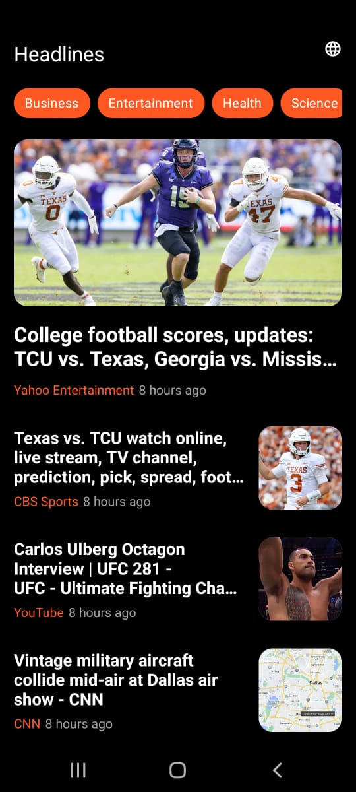
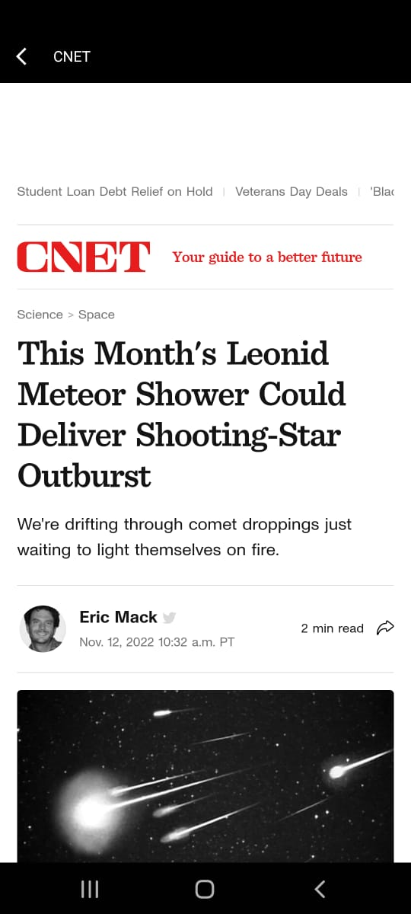
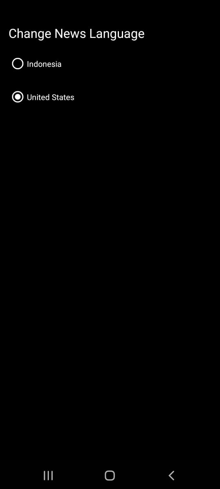
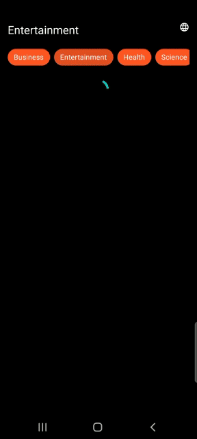
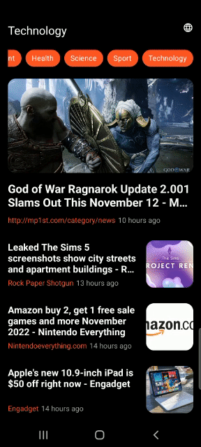

Technical Test - Salt 

User Case: 
  1. Buatlah satu project aplikasi native Android yang terintegrasi dengan https://newsapi.org/
  2. Buatlah satu halaman untuk menampilkan daftar berita dari https://newsapi.org/docs/endpoints/topheadlines
  3. Buatlah satu halaman lagi untuk menampilkan detail berita dari response yang sudah didapatkan
  4. Buatlah tampilan semenarik mungkin
  5. Anda bebas menggunakan library yang menurut Anda familiar
  6. Lebih baik jika Anda bisa menggunakan design pattern atau architecture yang familiar menurut Anda
  7. Submit source code dalam bentuk repository yang dapat di-share kepada kami
  8. Sertakan screenshot hasil aplikasi di dalam repository

Bahasa : Kotlin

Library yang dipakai:
  - Glide : https://github.com/bumptech/glide
  - Shimmer : https://facebook.github.io/shimmer-android/
  - Retrofit : https://square.github.io/retrofit/

Architecture yang dipakai: 
  - MVVM

Screenshot:
 
Headline - Landing Page:
 

 
 
GIF:

